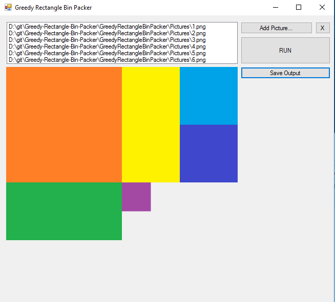

# Greedy-Rectangle-Bin-Packer
A quick, clean, and commented 2D rectangle bin packer coded in VB.Net.

The code is cleanly organized into two classes ("GRBSBin.vb" and "GRBSImage.vb"), and the only code contained within the form itself pertains to selecting images, and calling the solver to run.  After the solver finishes it's work, it displays the output to a picturebox with an option to save the atlas to a PNG.

If you use this code, please give credit!
